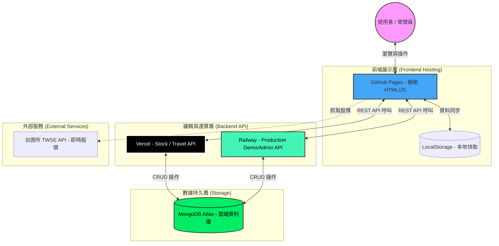

# Qware 報表系統整體架構圖 (System Architecture)

## 系統流圖 (System Flowchart)

---

## 流程說明 (Process Description)

### 1. 資料讀取流程 (Data Fetching)
1.  **使用者**開啟網頁後，前端 **JS** 優先嘗試從 **LocalStorage** 讀取快取以加速首屏顯示。
2.  同時發出 **REST API** 請求至 **Vercel** 或 **Railway**。
3.  後端轉發請求至 **MongoDB Atlas** 獲取最新資料。
4.  資料回傳後更新前端畫面並同步回寫至 **LocalStorage**。

### 2. 資料更新流程 (CRUD Update)
1.  **管理員**通過密碼驗證開啟編輯模式。
2.  修改後的數據同時發送至 **後端 API** 與 **LocalStorage**。
3.  後端確保 **MongoDB** 寫入成功後回傳 OK。
4.  前端 UI 即時重新渲染（如卡片數字跳動、小計更新）。

### 3. 外部數據集成 (External Integration)
1.  針對股票系統，前端直接（或透過後端代理）呼叫 **台證所 API**。
2.  獲取價格後，前端與本地存儲的成本資料進行即時損益運算，而不需頻繁存取資料庫。

### 4. 部署自動化 (CI/CD)
*   **代碼變更**：Git Push 觸發 GitHub Actions 部署至 GitHub Pages。
*   **後端變更**：自動觸發 Vercel / Railway 生產環境更新。
