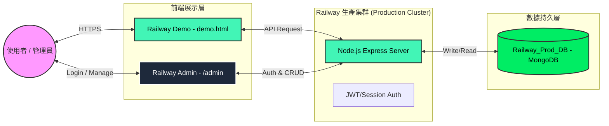

# Railway 生產環境系統架構 (Railway Project Architecture)

## 專屬系統流圖 (Railway Flowchart)

---

## 23 & 24 整合運作流程

### 1. 展示頁面 (Demo) 流向
*   **載入**：前端發送請求至 Railway API。
*   **獲取**：API 從 `Railway_Prod_DB` 擷取生產環境數據。
*   **渲染**：以玻璃擬態 UI 展示即時專案狀態。

### 2. 管理後台 (Admin) 流向
*   **驗證**：進入 `/admin` 需通過安全密碼驗證取得 JWT 憑證。
*   **監控**：管理員可直接查閱資料庫狀態與即時 API 流量日誌。
*   **操作**：執行新增、修改、刪除動作後，API 同步更新資料庫，並使 Demo 頁面即時反映變更。

### 3. 環境特點
*   **全站 HTTPS**：強制使用 Railway 提供之 SSL 加密連線。
*   **零時差同步**：所有操作直接作用於生產環境資料庫，無快取延遲。
